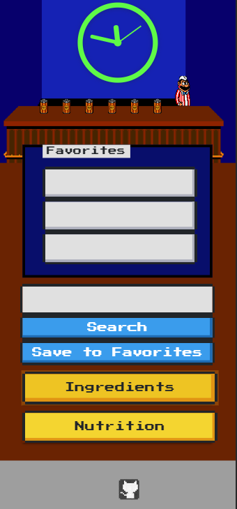

# 8-bit Bartender

This is our project 8-bit-bartender.

## Link to the website

Our live deployment of 8-Bit Bartender is located here: <https://eelektrick.github.io/8-bit-bartender/>

## How to use 8-bit-bartender

First type in cocktail drink of your choice and press search.

Next click on ingredients button to view what is used to make the cocktail.

Next click on nutrion button to view the nution level of the search drink.

If you want to save the drink for future viewing click save to favorites.

## Our Journey creating 8-bit-bartender

Deciding who would work on what part of the app was not difficult choice for the 6 of us.

Ran into issues with making 2 frameworks work together but after some time and a complete group effort problems were solved

Calling both server APIs were a struggle but after some trial and error we got the information to appear in the html from the button clicks.

### Project Title: 

8-bit Bartender

### Project Description:

A retro-themed guide to cocktail recipes & nutritional information. A user can submit a cocktail, and the ingredients & nutritional information will be provided.

### User Story:

- AS A user & cocktail connoisseur

- I WANT ingredients & nutritional info about the cocktail that I'm searching

- SO THAT I know more about about the cocktail & how it aligns with my dietary requirements.

### Sketch of the Initial design:

### APIs to be used:

#### Server-Side APIs:

[Cocktail DB API to get cocktail ingredients](https://rapidapi.com/theapiguy/api/the-cocktail-db?endpoint=apiendpoint_49b98879-938e-4479-b0da-718468fb87bc)

[Nurition API to get nutritional info from Nutrionix](https://rapidapi.com/msilverman/api/nutritionix-nutrition-database)

#### 3rd-party API:

[Moment.js to display retro clock](https://momentjs.com/)

### CSS Frameworks: 

[Materialize](https://materializecss.com/)

[NES.css](https://nostalgic-css.github.io/NES.css/)

### Future functionality:

[Wikipedia to pull relevant facts/info about cocktail](https://www.mediawiki.org/wiki/API:Main_page)